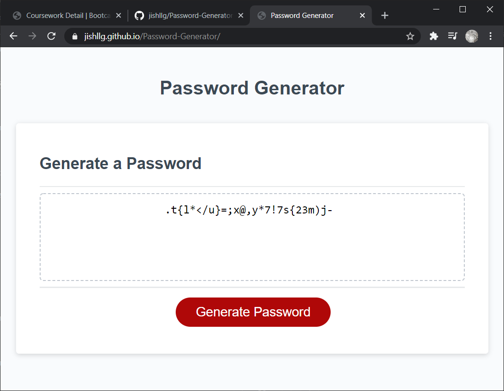

# Password-Generator
A simple, customizable password generator. The HTML, CSS, and the DOM integration portions of the JavaScript were provided by the University of Minnesota coding boot camp.

# Links
Application: https://jishllg.github.io/Password-Generator
 
Repository: https://github.com/jishllg/Password-Generator

# Usage
Simply click the "Generate Password" button, and the site will prompt you for specifications about your ideal password. 
  
